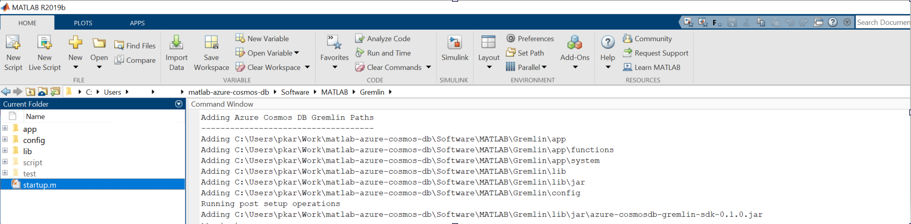
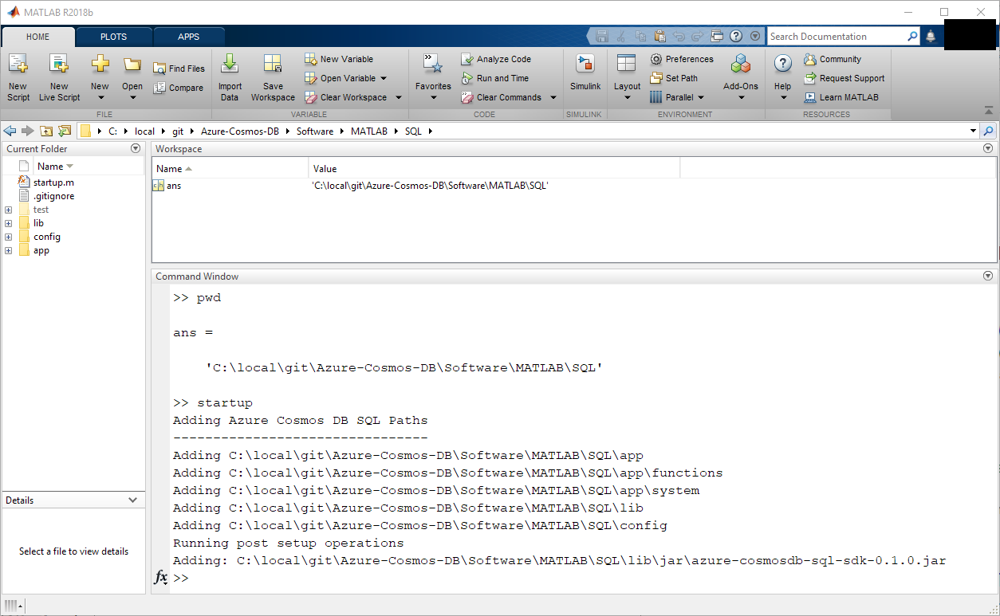
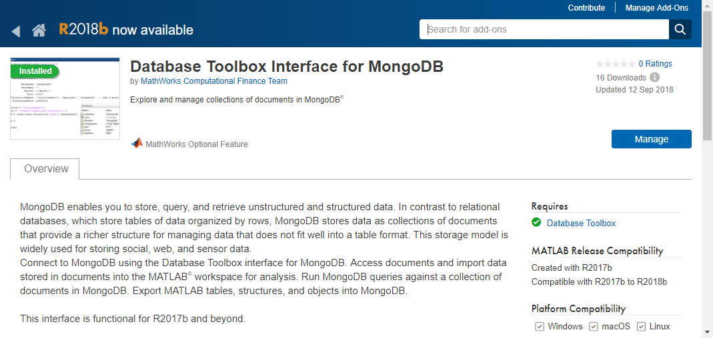

# Installation

## Installing on Windows®, macOS® and Linux

If installing based on a source code only, e.g. from GitHub, first build any required jar files. Instructions to do can be found here: [Build](Rebuild.md). Once built the package is installed as follows.

### Gremlin Interface
1. Copy the contents of the package to the desired location.
2. From command prompt or git bash, navigate to matlab-azure-cosmos-db/Software/Java/Gremlin and build using maven.Run  ```mvn clean package```.
3. From within MATLAB® change directory to  matlab-azure-cosmos-db/Software/MATLAB/Gremlin subdirectory and run the *startup.m* file. This updates the relevant paths.

The package is now ready for use.

### SQL Interface
1. Copy the contents of the package to the desired location.
2. From within MATLAB® change directory to that location and then to the Software/MATLAB/SQL subdirectory and run the *startup.m* file. This updates the relevant paths. Output similar to the following should be shown:

The package is now ready for use.


### MongoDB Interface
From release 0.1.4 of this package, supplementary support to enable the Cosmos DB MongoDB API is no longer required and has been removed. The Database Toolbox Interface for MongoDB now supports the Cosmos DB MongoDB API directly.

The interface's Cosmos DB MongoDB API support requires the following installation steps:
1. Ensure the MathWorks Database Toolbox is installed, it should be visible in the list returned by the *ver* command if installed.
2. Install the Database Toolbox Interface for MongoDB. This package installation details can be found here: [https://www.mathworks.com/help/database/ug/database-toolbox-interface-for-mongodb-installation.html](https://www.mathworks.com/help/database/ug/database-toolbox-interface-for-mongodb-installation.html). Select the latest release. Once installed it will appear in add-on manager as shown:

3. It is no longer necessary to add an updated `mongo.m` file to the beginning of the MATLAB path.

Existing code will require the following minor update. The connection creation step, e.g.:

```matlab
conn = mongo(endPoint, 10255, databaseName, "UserName", string(config.accountName),"Password", string(config.password),...
             "AuthMechanism", "MONGODB_CR", "SSLEnable", true);
```

should be updated to resemble the following:
```matlab
conn = mongo(endPoint, 10255, databaseName, "UserName", string(config.accountName),"Password", string(config.password),..
             "AuthMechanism", "SCRAM_SHA_1", "SSLEnabled", true);
```

* The `MONGODB_CR` authentication mechanism has been deprecated in the MongoDB Java driver and is no longer supported, `SCRAM_SHA_1` is the recommended alternative.
* Note the minor parameter name change from `SSLEnable` to `SSLEnabled`.


### Table Interface
1. The Cosmos DB Table interface uses the [MATLAB Interface *for Windows Azure Storage Blob*](https://github.com/mathworks-ref-arch/matlab-azure-blob) package to provide underlying support for the Azure WASB Table API. This Interface should be first downloaded and installed.
2. Using the Cosmos DB interface Table API is then a question of using Cosmos DB specific connection process.

MATLAB can be configured to call startup.m on startup if preferred so that the package is always available automatically. For further details see: [https://www.mathworks.com/help/matlab/ref/startup.html](https://www.mathworks.com/help/matlab/ref/startup.html). Path updates can also be invoked at startup in this way.


[//]: #  (Copyright 2017-2021 The MathWorks, Inc.)
